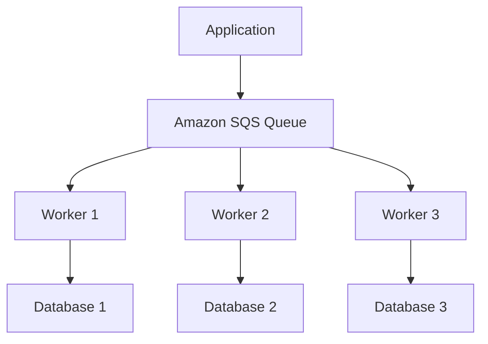
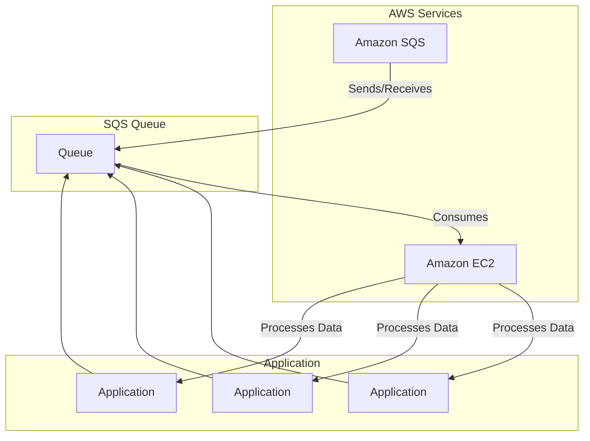
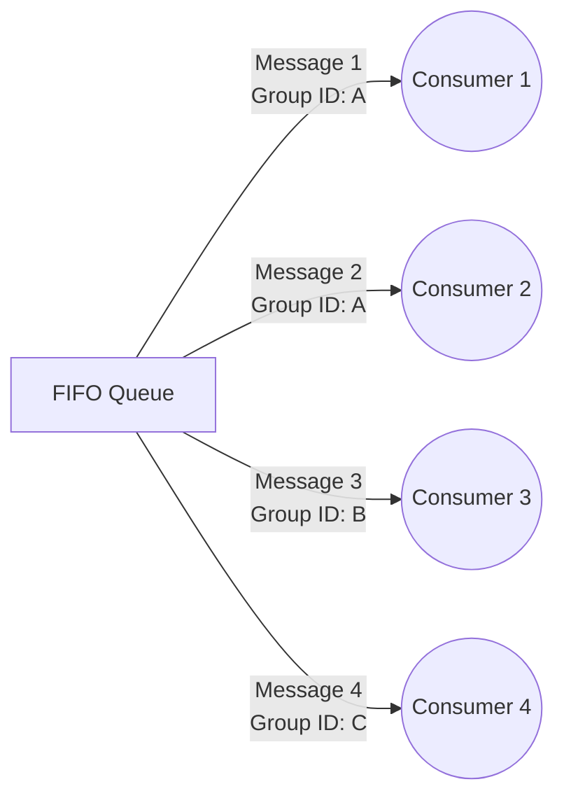
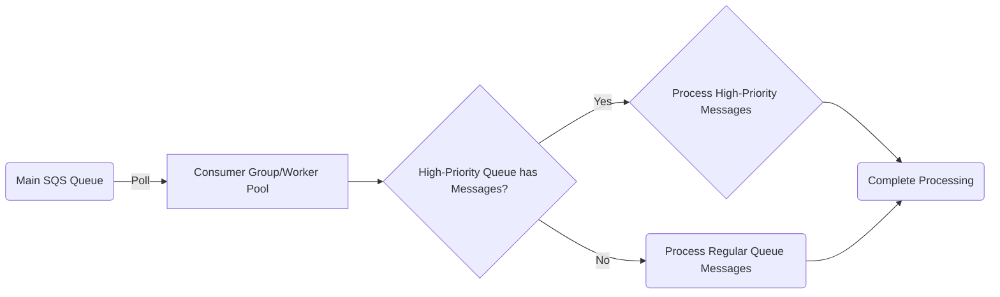
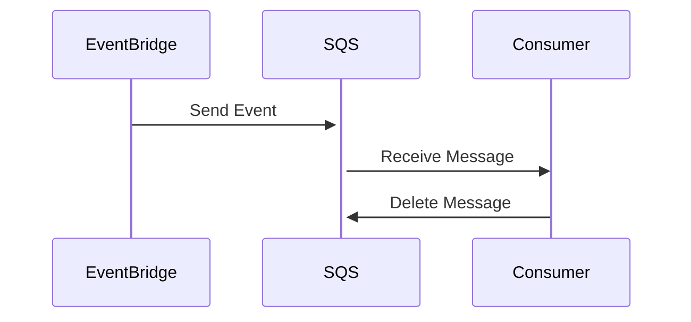

#### What is Amazon SQS?

##### Features 
1. Fully-managed message queuing service provided by AWS.
2. It enables you to decouple and scale distributed applications, microservices, and serverless applications.
3. It separate the components of your application and communicate between them **asynchronously**.
SQS is a reliable and scalable service that can handle millions of messages per second. 
4. It can be used to build a variety of **distributed applications**, such as event-driven architectures, message-based architectures, and serverless architectures.
5. When you send a message to an SQS queue, it is stored and then delivered to one or more consumers when they are ready to receive it. This means that you can easily build distributed systems that can scale up or down according to demand.

Here's a more detailed explanation of how SQS works:

1. **Messages**: Messages are units of data that are sent to and from the queue. Messages can be in any format (text, binary, JSON, XML, etc.) up to 256KB in size.

2. **Queues**: Queues are storage locations for messages. Messages are added to the end of a queue and are retrieved from the front of the queue. SQS provides two types of queues: standard and FIFO (first-in, first-out).

3. **Producers**: Producers are applications or services that send messages to SQS. When a producer sends a message to SQS, it is added to the end of the queue.

4. **Consumers**: Consumers are applications or services that retrieve messages from SQS. When a consumer retrieves a message, it is removed from the front of the queue. Once a message is retrieved, it cannot be retrieved again.

5. **Polling**: Consumers can retrieve messages from SQS using polling. Polling involves repeatedly asking SQS if there are any messages in the queue. If there are, SQS returns the messages to the consumer. If there are no messages, SQS returns an empty response. Polling can be done using short polling (the default) or long polling.

6. **Visibility timeout**: When a message is retrieved from a queue, it becomes invisible to other consumers for a period of time called the visibility timeout. This prevents multiple consumers from retrieving the same message. Once the visibility timeout expires, the message becomes visible again and can be retrieved by another consumer.

7. **Dead-letter queue**: A dead-letter queue is a queue that receives messages that cannot be processed successfully by the consumer. These messages can be analyzed and debugged to determine the cause of the failure.

##### SQS Benefits

1. **Scalability**: SQS scales seamlessly, allowing you to send or receive any number of messages, with no loss of performance.

2. **Reliability**: SQS is highly reliable and durable. Your messages are stored redundantly across multiple availability zones, ensuring that they are always available.

3. **Fault-tolerance**: SQS provides fault-tolerance by automatically replicating your messages across multiple servers.

4. **Cost-effective**: With SQS, you only pay for the number of messages you send or receive, making it a cost-effective solution for building distributed systems.

5. **Security**: SQS provides encryption of messages in transit and at rest, ensuring that your data is always secure.
6. **Decoupling**: Amazon SQS helps to decouple the components of a distributed application, making it easier to develop, maintain and scale each component independently.


**Example 1**
In this diagram, the "Application" component sends messages to an "Amazon SQS Queue". The "Worker 1", "Worker 2", and "Worker 3" components are responsible for processing the messages from the queue, and they each interact with their respective databases: "Database 1", "Database 2", and "Database 3".



**Example 2**

The flow of data is as follows:

1. The application components send data to the message queue hosted on Amazon SQS.
2. The queue sends the data to Amazon EC2 instances for processing.
3. The Amazon EC2 instances process the data using components A, B, and C.
4. The processed data is then sent back to the message queue for other components to process.



#### Componenets of distributed messaging system
A distributed messaging system typically consists of several components that work together to allow applications to communicate with each other in a loosely coupled manner. Here are some of the key parts of a distributed messaging system:

1. **Message Producer**: This is the component responsible for producing messages and sending them to the messaging system.
2. **Messaging System**: This is the middleware that manages the messages, queues them, and delivers them to the consumers.
3. **Message Consumer**: This is the component that receives messages from the messaging system and processes them.
4. **Message Broker**: This is an optional component that acts as an intermediary between the producers and consumers. It can help to decouple the producers from the consumers and provide additional features such as message filtering, routing, and transformation.

#### Lifecycle of SQS
1. **Message Production**: A message is produced by a message producer and sent to an SQS queue.
2. **Message Storage**: The message is stored in the SQS queue until it is retrieved by a message consumer.
3. **Message Retrieval**: A message consumer retrieves the message from the queue using a receive message request.
4. **Message Processing**: The consumer processes the message and then deletes it from the queue using a delete message request. If the consumer does not delete the message, it remains in the queue and becomes visible to other consumers after the visibility timeout period expires.
5. **Message Visibility Timeout**: After a message is retrieved by a consumer, it becomes invisible to other consumers for a configurable visibility timeout period. This ensures that the message is not processed by multiple consumers at the same time.
6. **Message Retention**: If a message is not deleted by the consumer within the retention period, it is automatically deleted from the queue.
7. **Message Delivery Delay**: You can configure a delay for message delivery, which allows you to delay the delivery of a message for a specified period of time after it is produced.

```graphql
resource "aws_sqs_queue" "example_queue" {
  name = "example-queue"
  
  # Configure the queue lifecycle
  redrive_policy = jsonencode({
    deadLetterTargetArn = aws_sqs_queue.example_dead_letter_queue.arn
    maxReceiveCount     = 3
  })
  
  message_retention_seconds = 86400 # 1 day
  visibility_timeout_seconds = 300 # 5 minutes
}

# Create a dead-letter queue for failed messages
resource "aws_sqs_queue" "example_dead_letter_queue" {
  name = "example-queue-dead-letter"
}

# Grant permissions to access the queue
resource "aws_sqs_queue_policy" "example_queue_policy" {
  queue_url = aws_sqs_queue.example_queue.url
  
  policy = jsonencode({
    Version = "2012-10-17"
    Statement = [
      {
        Sid = "AllowSendMessage"
        Effect = "Allow"
        Principal = "*"
        Action = [
          "sqs:SendMessage",
          "sqs:GetQueueAttributes",
          "sqs:GetQueueUrl"
        ]
        Resource = aws_sqs_queue.example_queue.arn
      }
    ]
  })
}
```

#### Differences between Amazon SQS, Amazon MQ, and Amazon SNS
Here are some key differences between these services:

- **Messaging Patterns**: Amazon SQS supports message queuing pattern, Amazon MQ supports both message queuing and publish/subscribe patterns, while Amazon SNS supports publish/subscribe pattern.
- **Protocols**: Amazon SQS supports HTTP/HTTPS, while Amazon MQ supports AMQP, MQTT, OpenWire, and STOMP. Amazon SNS supports HTTP, HTTPS, email, SMS, and mobile push notifications.
- **Durability**: Amazon SQS stores messages in multiple copies across multiple Availability Zones to ensure durability, while Amazon MQ stores messages on disk to ensure durability. Amazon SNS does not store messages and only delivers them to subscribers in real-time.
- **Scalability**: All three services are highly scalable, but Amazon SQS and Amazon SNS are designed for high volume and high throughput messaging, while Amazon MQ is designed for more traditional messaging workloads
- **Pricing**: Amazon SQS and Amazon SNS charge based on the number of messages sent, received, and stored, while Amazon MQ charges based on the instance type and broker usage.

#### Pricing for Amazon SQS
Amazon SQS pricing is based on a **pay-as-you-go** model, where you are charged based on the number of requests you make, the amount of data you transfer, and the storage used. Here's a breakdown of the pricing components for Amazon SQS:

**Requests**: You are charged for every API request you make to Amazon SQS. This includes sending, receiving, deleting, and changing the visibility of messages. The pricing for requests is $0.0000004 per request.

**Data Transfer**: You are charged for data transfer in and out of Amazon SQS. This includes data transfer between the service and your application, as well as data transfer between regions. The pricing for data transfer is $0.01 per GB.

**Storage**: You are charged for the amount of storage used by your messages in the SQS queue. The pricing for storage is $0.00073 per GB per month.

Here's an example of how to calculate the cost of using Amazon SQS:

Let's say -
- You send and receive 1 million messages per day, and each message is 10 KB in size. 
- This would result in a data transfer of 20 GB per day (10 KB x 1 million x 2). 
- If you keep the messages in the queue for 1 week, this would result in a storage usage of 14 GB (10 KB x 1 million x 7 days).

Using the pricing components above, the cost for sending and receiving 1 million messages per day would be:

- **Requests**: 2 million requests per day (1 million sends + 1 million receives) x $0.0000004 per request = $0.0008 per day
- **Data Transfer**: 20 GB per day x $0.01 per GB = $0.20 per day
- **Storage**: 14 GB x $0.00073 per GB per month x 30 days / 31 days = $0.0125 per day
- The **total cost** for sending and receiving 1 million messages per day would be approximately $0.233 per day.

It's worth noting that Amazon SQS also offers a free tier of usage for up to 1 million requests per month, and up to 1 GB of data transfer and 1 GB of storage per month, which can help you get started with the service at no cost.

#### SQS queue types
Amazon SQS offers two types of queues: Standard Queue and FIFO Queue. Here's a detailed explanation of each type:

Here are more details on each type of queue:

**Standard Queue**: This is the default type of queue and provides a reliable, scalable, and fully-managed messaging system for sending and receiving messages. It offers a high throughput and low latency messaging service with at-least-once delivery of messages. Standard Queues do not provide any guarantees for message ordering or deduplication.

**FIFO Queue**: This type of queue is designed for use cases that require strict message ordering and exact-once processing. FIFO (First-In-First-Out) Queues guarantee the order of messages, ensuring that messages are processed in the order in which they are sent. FIFO queues support deduplication of messages, which ensures that a message is delivered only once. FIFO queues are designed for use cases with lower throughput requirements and have a lower maximum capacity of 300 transactions per second.

| Feature              | Standard Queue         | FIFO Queue                                        |
|----------------------|------------------------|---------------------------------------------------|
| Ordering of messages | Not guaranteed         | Guaranteed                                        |
| Delivery             | At least once          | Exactly once                                      |
| Capacity             | Unlimited              | Up to 300 transactions per second (TPS) per queue |
| Deduplication        | Not supported          | Supported                                         |
| Message groups       | Not supported          | Supported                                         |
| Delay queues         | Supported              | Supported                                         |
| Redrive policy       | Supported              | Supported                                         |
| Cost                 | Lower cost per message | Higher cost per message                           |

#### Amazon SQS FIFO
Amazon SQS FIFO (First-In-First-Out) queues are a type of message queue that guarantee the order of messages and ensure that each message is processed exactly once. This makes them ideal for applications where message order and consistency are critical, such as financial transactions, stock trading, and other real-time systems.

###### FIFO queues have the following characteristics:

1. Ordering: Messages in a FIFO queue are processed in the order in which they are added to the queue. This means that the first message added to the queue is the first message to be processed.
2. Deduplication: FIFO queues ensure that each message is processed exactly once by using message deduplication. This means that if a message with a specific message ID is already in the queue, any subsequent messages with the same ID will be discarded.
3. Capacity: FIFO queues have a maximum capacity of 300 transactions per second (TPS) per queue.
4. Message Groups: FIFO queues support the use of message groups, which allow you to group related messages together and ensure that they are processed in the order in which they are added to the queue.
5. Cost: FIFO queues are more expensive than standard queues, with a higher cost per message.

When using a FIFO queue, it's important to ensure that your application complies with the FIFO queue requirements. For example, each message must have a unique message ID, and the total number of messages in a message group cannot exceed 3,000.

FIFO queues also offer features such as delay queues, which allow you to set a delay before messages become available for processing, and redrive policies, which enable you to automatically send messages to a dead-letter queue after a specified number of delivery attempts.

Overall, FIFO queues provide a reliable and scalable messaging solution for applications that require strict message ordering and exactly-once processing.



##### SQS capabilities
1. **Messaging types**: Amazon SQS supports two types of messaging: standard and FIFO. Standard queues are fast, scalable, and provide at-least-once delivery, while FIFO queues are designed to ensure that messages are processed exactly once, in the order in which they are received.
2. **Message retention**: Amazon SQS allows you to set a retention period for messages, which determines how long messages are retained in the queue before they are deleted. The default retention period is four days, but you can set this value anywhere between one minute and 14 days.
3. **Message size**: Amazon SQS allows you to send messages up to 256 KB in size, but you can also send larger messages by using the Amazon Simple Notification Service (SNS) to publish messages to an Amazon SQS queue.
4. **Message visibility**: When a consumer retrieves a message from an Amazon SQS queue, the message becomes invisible to other consumers for a specified period of time, known as the visibility timeout. This prevents other consumers from processing the same message simultaneously.
5. **Dead-letter queues**: Amazon SQS provides dead-letter queues, which allow you to set up a separate queue to receive messages that could not be processed after a certain number of attempts. This helps you identify and troubleshoot failed messages.
6. **Batch operations**: Amazon SQS allows you to send and receive messages in batches, which can improve efficiency and reduce costs by reducing the number of API calls required.
7. **API and SDKs**: Amazon SQS provides a comprehensive set of APIs and SDKs for a variety of programming languages, including Java, Python, Ruby, and .NET.
8. **Encryption and security**: Amazon SQS uses encryption in transit and at rest to help secure your messages. You can also use AWS Key Management Service (KMS) to manage your encryption keys.
9. **Metrics and monitoring**: Amazon SQS provides metrics and monitoring capabilities through Amazon CloudWatch, which allows you to monitor the performance and availability of your queues in real-time.

#### Other topics to know
1. Queue and message identifiers: Each Amazon SQS queue has a unique identifier called a queue URL, which is used to access the queue. When you send a message to an Amazon SQS queue, the service assigns it a unique identifier called a message ID, which you can use to retrieve or delete the message.
2. Message metadata: In addition to the message body, Amazon SQS allows you to include metadata with each message, such as a message ID, message attributes (key-value pairs), and a message receipt handle (used to delete or change the visibility timeout of a message).
3. Resources required to process messages: The resources required to process messages depend on the complexity of your application and the workload of your messages. Amazon SQS provides a range of tools and features, such as dead-letter queues, visibility timeouts, and message timers, to help you manage your workload and optimize your resource usage.
4. List queue pagination: Amazon SQS allows you to retrieve a list of your queues using the ListQueues API. If you have a large number of queues, the response may be paginated to reduce the response time. You can use the NextToken parameter to retrieve the next page of results.
5. Cost allocation tags: Amazon SQS allows you to assign cost allocation tags to your queues, which can help you track and manage your costs. You can assign tags to queues when you create them or using the TagQueue API.
6. Short and long polling: Amazon SQS supports two types of message polling: short polling and long polling. With short polling, the consumer requests messages from the server and immediately receives a response, even if the queue is empty. With long polling, the consumer waits for a specified period of time (up to 20 seconds) for a message to become available. Long polling can help reduce costs and improve performance by reducing the number of API calls required.Dead-letter queues: Amazon SQS provides dead-letter queues, which allow you to set up a separate queue to receive messages that could not be processed after a certain number of attempts. You can configure a queue to send failed messages to a dead-letter queue using the RedrivePolicy attribute.
7. Visibility timeout: When a consumer retrieves a message from an Amazon SQS queue, the message becomes invisible to other consumers for a specified period of time, known as the visibility timeout. This prevents other consumers from processing the same message simultaneously. If a consumer does not delete the message before the visibility timeout expires, the message becomes visible again and can be retrieved by another consumer.
8. Delay queues: Amazon SQS provides delay queues, which allow you to set a delay period for messages before they become available for consumption. This can be useful for tasks that need to be executed at a specific time, such as sending a reminder email or processing a recurring payment.
9. Temporary queues: Amazon SQS allows you to create temporary queues, which are automatically deleted after a specified period of inactivity. Temporary queues can be useful for situations where you need to create a short-lived queue for a specific purpose, such as processing the results of a batch job.
10. Message timers: Amazon SQS allows you to set a timer on a message, which can be used to delay the delivery of the message or to trigger an action after a certain period of time. You can set a timer using the DelaySeconds attribute or the SendMessageDelaySeconds parameter.

#### Configuring Amazon SQS queues
Configuring an Amazon SQS queue involves setting up various parameters and attributes to customize the behavior of the queue. Here are some of the key configuration options available in Amazon SQS:

Queue type: Amazon SQS supports two types of queues, standard and FIFO. Standard queues provide best-effort ordering of messages and can deliver a message multiple times, while FIFO queues provide strict ordering of messages and deliver each message exactly once.

Queue name: Each Amazon SQS queue must have a unique name, which can be up to 80 characters long and can contain alphanumeric characters, hyphens, and underscores.

Queue attributes: Amazon SQS provides several queue attributes that you can configure to customize the behavior of the queue. Some of the most commonly used attributes include:

VisibilityTimeout: Sets the amount of time a message remains invisible to other consumers after a consumer retrieves it.
MaximumMessageSize: Sets the maximum size of a message that can be sent to the queue.
MessageRetentionPeriod: Sets the amount of time a message remains in the queue before it is automatically deleted.
RedrivePolicy: Specifies the dead-letter queue for the queue and the maximum number of times a message can be retried before being sent to the dead-letter queue.
Access control: Amazon SQS allows you to control access to your queues using IAM policies. You can set policies to control who can send messages to a queue, who can receive messages from a queue, and who can manage the queue.

Encryption: Amazon SQS supports encryption of messages in transit and at rest. You can enable encryption using AWS Key Management Service (KMS) to encrypt messages using customer-managed keys.

Monitoring and alerts: Amazon SQS provides several tools for monitoring and alerting on queue activity, including CloudWatch metrics, CloudWatch alarms, and Amazon SNS notifications.

Cross-region replication: Amazon SQS allows you to replicate your queues across multiple regions for increased availability and disaster recovery. You can enable cross-region replication using the ReplicationRegions attribute.

Overall, configuring an Amazon SQS queue involves carefully selecting the appropriate queue type, setting up the necessary attributes, and implementing access controls, encryption, and monitoring to ensure the queue operates correctly and securely.


#### Attribute-Based Access Control
Attribute-Based Access Control (ABAC) is a security model that allows you to control access to your Amazon SQS queues based on attributes of the requesting entity, such as the user's role, department, or location. ABAC enables fine-grained access control and helps you to manage permissions more efficiently.

Amazon SQS supports ABAC through the use of IAM policies and resource-based policies. You can define conditions in your policies that use attributes of the requesting entity to control access to your SQS queues. For example, you can grant access to a specific queue only to users with a certain role or department.

Here is an example IAM policy that implements ABAC for an Amazon SQS queue:

```yaml
{
    "Version": "2012-10-17",
    "Statement": [
        {
            "Effect": "Allow",
            "Action": "sqs:*",
            "Resource": "arn:aws:sqs:us-west-2:123456789012:my-queue",
            "Condition": {
                "StringEquals": {
                    "aws:PrincipalTag/Department": "Engineering"
                }
            }
        }
    ]
}
```

#### Configuring access policy
Here are some key steps for configuring access policies in Amazon SQS:

**Define your access policy**: You can create an access policy using the AWS Policy Generator or by writing the JSON document yourself. The access policy should specify the actions that users or roles are allowed to perform on the queue, as well as any conditions that must be met for access to be granted.

**Attach the policy to your queue**: Once you have defined your access policy, you can attach it to your queue by navigating to the queue in the Amazon SQS console, selecting the Access policy tab, and then pasting the policy into the editor.

**Test your access policy**: After you have attached the access policy to your queue, you should test it to ensure that it is working as intended. You can do this by attempting to access the queue using the specified permissions, and verifying that the expected actions are allowed or denied.


Some key considerations when configuring access policies for Amazon SQS include:

**Use least privilege**: *To ensure that your queues are secure, it is important to grant users or roles only the minimum level of access required to perform their intended actions.*

**Use conditions**: *Access policies in Amazon SQS can include conditions that must be met in order for access to be granted. This can be useful for enforcing restrictions based on specific IP addresses or time periods.*

**Regularly review and update policies**: *As your applications and infrastructure evolve, it is important to periodically review your access policies to ensure that they remain up-to-date and effective.*

Here is an example of an access policy that grants read and write access to a specific Amazon SQS queue to a specific AWS IAM user:

```yaml
{
  "Version": "2012-10-17",
  "Id": "arn:aws:sqs:us-west-2:123456789012:MyQueue/SQSDefaultPolicy",
  "Statement": [
    {
      "Sid": "AllowUserToReadWrite",
      "Effect": "Allow",
      "Principal": {
        "AWS": "arn:aws:iam::123456789012:user/my-iam-user"
      },
      "Action": [
        "sqs:SendMessage",
        "sqs:ReceiveMessage",
        "sqs:DeleteMessage",
        "sqs:GetQueueAttributes",
        "sqs:GetQueueUrl"
      ],
      "Resource": "arn:aws:sqs:us-west-2:123456789012:MyQueue"
    }
  ]
}
```

In this example, the access policy includes the following elements:

**Version**: *This specifies the version of the access policy language. The value "2012-10-17" indicates the current version.*

**Id**: *This provides a unique identifier for the access policy.*

**Statement**: *This is an array of one or more policy statements that specify the permissions for different users or groups.*

**Sid**: *This provides a unique identifier for each policy statement.*

**Effect**: *This specifies whether the policy statement allows or denies access. The value "Allow" indicates that access is allowed.*

**Principal**: *This specifies the AWS user or group to which the policy statement applies. In this example, the policy statement applies to the IAM user with the ARN arn:aws:iam::123456789012:user/my-iam-user.*

**Action**: *This specifies the Amazon SQS API actions that the user or group is allowed to perform. In this example, the user is allowed to perform the sqs:SendMessage, sqs:ReceiveMessage, sqs:DeleteMessage, sqs:GetQueueAttributes, and sqs:GetQueueUrl actions.*

**Resource**: *This specifies the Amazon SQS queue to which the policy statement applies. In this example, the policy statement applies to the queue with the ARN arn:aws:sqs:us-west-2:123456789012:MyQueue.*


#### Configuring server-side encryption (SSE) for a queue using SQS-managed encryption keys
Amazon SQS provides an option to encrypt the messages in a queue at rest using server-side encryption (SSE) with SQS-managed keys. This provides an additional layer of security to protect the data in your queue. Configuring SSE for a queue using SQS-managed encryption keys is a simple process that can be done through the Amazon SQS console or programmatically using the AWS SDK.

To configure SSE for a queue using SQS-managed encryption keys through the Amazon SQS console, follow these steps:

Open the Amazon SQS console and select the queue that you want to encrypt.

- Click the Configuration tab, and then click the Edit button next to the Encryption section.
- Choose the Enable encryption option and then select AWS managed key from the Key Management Service (KMS) dropdown list.
- Choose the Create new KMS master key option or select an existing key from the dropdown list.
- Click the Save Changes button to apply the encryption settings to the queue.

Once you have enabled encryption for your Amazon SQS queue, all messages that are sent to the queue will be automatically encrypted using SQS-managed encryption keys. When a message is received from the queue, it is automatically decrypted by Amazon SQS before being delivered to the recipient.


#### Configuring server-side encryption (SSE) for a queue 

*Amazon SQS provides an option to encrypt the messages in a queue at rest using server-side encryption (SSE) with customer-managed keys. This provides an additional layer of security to protect the data in your queue. Configuring SSE for a queue using customer-managed encryption keys is a simple process that can be done through the Amazon SQS console or programmatically using the AWS SDK.*

#### Configuring a dead-letter queue
*Amazon SQS provides the option to configure a dead-letter queue for a source queue. A dead-letter queue is a queue that receives messages that cannot be processed successfully from the source queue after a specified number of retries. Configuring a dead-letter queue can help you diagnose and troubleshoot issues with message processing in your application.*

*Here's an example of how to configure a dead-letter queue for an Amazon SQS queue using the AWS SDK for Python (Boto3):*

```python
import boto3

sqs = boto3.client('sqs')

# Create a new dead-letter queue
dead_letter_queue_name = 'my-dead-letter-queue'
dead_letter_queue_response = sqs.create_queue(QueueName=dead_letter_queue_name)
dead_letter_queue_url = dead_letter_queue_response['QueueUrl']

# Configure the source queue to use the dead-letter queue
source_queue_url = 'my-source-queue-url'
redrive_policy = {
    'deadLetterTargetArn': 'arn:aws:sqs:us-east-1:123456789012:{}'.format(dead_letter_queue_name),
    'maxReceiveCount': '5'
}
sqs.set_queue_attributes(QueueUrl=source_queue_url, Attributes={'RedrivePolicy': json.dumps(redrive_policy)})
```


In this example, we create a new dead-letter queue and retrieve its URL. We then configure the source queue to use the dead-letter queue by setting the RedrivePolicy attribute to a JSON string that includes the ARN of the dead-letter queue and the maximum number of times that a message can be received before it is sent to the dead-letter queue. In this example, we set the maximum receive count to 5.

Once the dead-letter queue is configured, any messages that cannot be processed successfully by the source queue after 5 receives will be sent to the dead-letter queue for further analysis.


```graphql
# Define the dead-letter queue
resource "aws_sqs_queue" "dead_letter_queue" {
  name = "my-dead-letter-queue"
}

# Define the source queue
resource "aws_sqs_queue" "source_queue" {
  name = "my-source-queue"
  
  # Configure the dead-letter queue
  redrive_policy = jsonencode({
    deadLetterTargetArn = aws_sqs_queue.dead_letter_queue.arn
    maxReceiveCount = 5
  })
}
```
In this example, we define two resources using the aws_sqs_queue Terraform provider: dead_letter_queue and source_queue.

We first define the dead_letter_queue resource, which creates a new dead-letter queue with the name "my-dead-letter-queue".

Next, we define the source_queue resource and set its name parameter to "my-source-queue". We also set the redrive_policy attribute to a JSON string that includes the ARN of the dead-letter queue and the maximum number of times that a message can be received before it is sent to the dead-letter queue.

The aws_sqs_queue provider will create both the source and dead-letter queues, and configure the source queue to use the dead-letter queue. Any messages that cannot be processed successfully by the source queue after 5 receives will be sent to the dead-letter queue for further analysis.

#### Subscribing an Amazon SQS queue to an Amazon SNS topic.


```bash
# Create an Amazon SNS topic
resource "aws_sns_topic" "my_topic" {
  name = "my-topic"
}

# Create an Amazon SQS queue
resource "aws_sqs_queue" "my_queue" {
  name = "my-queue"
}

# Subscribe the Amazon SQS queue to the Amazon SNS topic
resource "aws_sns_topic_subscription" "my_subscription" {
  topic_arn = aws_sns_topic.my_topic.arn
  protocol  = "sqs"
  endpoint  = aws_sqs_queue.my_queue.arn
}
```

#### Configuring a queue to trigger an AWS Lambda function. 

```graphql
# Create an Amazon SQS queue
resource "aws_sqs_queue" "my_queue" {
  name = "my-queue"
}

# Create an AWS Lambda function
resource "aws_lambda_function" "my_function" {
  filename      = "my_function.zip"
  function_name = "my-function"
  role          = aws_iam_role.my_role.arn
  handler       = "my_function.handler"
  runtime       = "nodejs14.x"
}

# Configure the Amazon SQS queue to trigger the AWS Lambda function
resource "aws_lambda_event_source_mapping" "my_mapping" {
  event_source_arn = aws_sqs_queue.my_queue.arn
  function_name    = aws_lambda_function.my_function.arn
  batch_size       = 10
}
```

#### Sending a message with attributes.

Example 1: Sending a message with a single attribute

```python
import boto3

# Create an SQS client
sqs = boto3.client('sqs')

# Specify the queue URL and message body
queue_url = 'https://sqs.us-west-2.amazonaws.com/123456789012/my-queue'
message_body = 'Hello, world!'

# Specify the message attribute name and value
attribute_name = 'MyAttribute'
attribute_value = 'MyAttributeValue'

# Send the message to the queue with the attribute
response = sqs.send_message(
    QueueUrl=queue_url,
    MessageBody=message_body,
    MessageAttributes={
        attribute_name: {
            'DataType': 'String',
            'StringValue': attribute_value
        }
    }
)

print(f"Message ID: {response['MessageId']}")
```

Example 2: Sending a message with multiple attributes

```python
import boto3

# Create an SQS client
sqs = boto3.client('sqs')

# Specify the queue URL and message body
queue_url = 'https://sqs.us-west-2.amazonaws.com/123456789012/my-queue'
message_body = 'Hello, world!'

# Specify the message attributes and their values
message_attributes = {
    'Attribute1': {
        'DataType': 'String',
        'StringValue': 'Value1'
    },
    'Attribute2': {
        'DataType': 'Number',
        'StringValue': '123'
    },
    'Attribute3': {
        'DataType': 'Binary',
        'BinaryValue': b'\x01\x02\x03'
    }
}

# Send the message to the queue with the attributes
response = sqs.send_message(
    QueueUrl=queue_url,
    MessageBody=message_body,
    MessageAttributes=message_attributes
)

print(f"Message ID: {response['MessageId']}")
```

#### How message will look with all the attributes ? 

Example 1
```yaml
{
    "MessageId": "f8d2d0ee-bb6c-4e37-bc8e-56cb85bf720b",
    "ReceiptHandle": "AQEBBJ+/7Bv...",
    "MD5OfBody": "f170a20baf...",
    "Body": "This is the message body",
    "Attributes": {
        "SenderId": "123456789012",
        "SentTimestamp": "1620368508475",
        "ApproximateReceiveCount": "3",
        "ApproximateFirstReceiveTimestamp": "1620368509581",
        "MessageDeduplicationId": "123456",
        "MessageGroupId": "group1"
    }
}
```

Example 2

```yaml
{
    "MessageId": "5dabb47d-6967-4f10-af13-2a2591b22e39",
    "Timestamp": "2023-05-06T14:30:00Z",
    "Body": "Symbol: AAPL, Order Type: Buy, Quantity: 1000",
    "Attributes": {
        "Priority": "10",
        "UrgencyFlag": "High",
        "ApproximateFirstReceiveTimestamp": "1651614000000",
        "ApproximateReceiveCount": "1",
        "SentTimestamp": "1651613945000"
    }
}
```

#### Case Study
Please come up with a strategy to process the message which has high priority as client is time sensitive. There are hundreds of other messages are also in the queue with lower priority.


One strategy to process high priority messages from an SQS queue is to use a separate consumer group or worker pool that is dedicated to handling high-priority messages. This can be achieved by creating a second SQS queue specifically for high-priority messages, and configuring the application to read from this queue before processing messages from the main queue.

Here are the steps to implement this strategy:

- Create a separate SQS queue for high-priority messages, and configure the queue to have a higher processing priority than the main queue.
- Configure the application to read from the high-priority queue first before processing messages from the main queue. This can be achieved by configuring the consumer group or worker pool to check for messages in the high-priority queue first, and only falling back to the main queue when no high-priority messages are available.
- Set up the application to monitor the high-priority queue for new messages and process them as soon as they arrive. Depending on the requirements of the application, this could involve processing messages in batches, using concurrency to process multiple messages simultaneously, or using a message processing framework such as AWS Lambda.
- Configure the visibility timeout and message retention period for the high-priority queue to ensure that messages are processed as quickly as possible. For example, you could set the visibility timeout to a low value such as 30 seconds to ensure that messages are re-queued quickly if they are not processed within a certain timeframe.
- By using a dedicated consumer group or worker pool for high-priority messages, and configuring the application to process these messages with higher priority than messages from the main queue, you can ensure that urgent messages are processed as quickly as possible, while still maintaining a separate queue for lower-priority messages that can be processed at a slower pace.



#### Quotas related to queues

| Quota                   | Description                                                                            |
|-------------------------|----------------------------------------------------------------------------------------|
| Number of Queues        | Maximum number of queues that can be created per AWS account                           |
| Queue Name              | Maximum length of a queue name                                                         |
| Messages                | Maximum number of messages per queue                                                   |
| Message Size            | Maximum size of a single message                                                       |
| Retention Period        | Maximum amount of time messages can be retained in the queue                           |
| Delay Time              | Maximum delay time for a message before it becomes available for processing            |
| Visibility Timeout      | Maximum visibility timeout for a message                                               |
| Polling Interval        | Minimum and maximum polling interval between requests to SQS                           |
| Long Polling            | Maximum long polling wait time                                                         |
| Batch Operations        | Maximum number of messages that can be sent or received in a single batch operation    |
| API Requests            | Maximum number of API requests per second                                              |
| Message Attributes      | Maximum number of attributes per message                                               |
| Dead-Letter Queue       | Maximum number of dead-letter queues that can be associated with a single source queue |
| Concurrent Consumers    | Maximum number of concurrent consumers that can process messages from a single queue   |
| Access Policies         | Maximum number of policies that can be attached to a single queue                      |
| Resource-Based Policies | Maximum size of a single resource-based policy attached to a queue                     |

#### Best practices when working with SQS
Here are some best practices to keep in mind when working with Amazon SQS:

**Use batching** : *Instead of sending messages one at a time, try to batch them together to reduce the number of API calls and increase throughput.*

**Use short polling for high throughput**: *Short polling is more efficient for high-throughput message processing, as it returns immediately with any available messages, while long polling can result in higher latency and increased costs.*

**Set appropriate visibility timeouts**: *The visibility timeout determines how long a message will be invisible to other consumers after it has been retrieved by a consumer. Set the timeout to an appropriate value based on the expected processing time of the message to avoid other consumers attempting to process the same message.*

**Use dead-letter queues**: *Set up a dead-letter queue to capture messages that cannot be processed by your application. This will help you identify and debug issues more easily.*

**Monitor queue metrics**: *Keep an eye on queue metrics such as message age, number of messages in the queue, and number of messages being processed to identify issues and ensure your application is running smoothly.*

**Use FIFO queues for ordered processing**: *If message order is important to your application, use a FIFO queue to ensure messages are processed in the order they were received.*

**Optimize queue settings**: *Set queue attributes appropriately based on your application's requirements, such as the visibility timeout and maximum message size.*

**Use multiple queues**: *To avoid congestion and bottlenecks, it's recommended to use multiple queues for different types of messages or workflows.*

**Use a distributed architecture**: *Consider using a distributed architecture to improve scalability and reduce the likelihood of a single point of failure.*

**Secure your queues**: *Implement security measures such as encryption and access control policies to protect your queues and the messages they contain.*

#### Reducing Amazon SQS costs
Amazon SQS is a cost-effective message queuing service, but there are some best practices you can follow to optimize costs:

**Set the correct message retention period**: *Ensure that the message retention period is set to the minimum amount of time necessary to prevent messages from being deleted before they can be processed.*

**Use long polling**: *Use long polling to reduce the number of requests to the Amazon SQS service, which can help reduce costs.*

**Optimize queue settings**: *Set queue attributes appropriately based on your application's requirements, such as the visibility timeout and maximum message size, to avoid unnecessary costs.*

**Use message batching**: *Use message batching to reduce the number of requests made to the Amazon SQS service, which can help reduce costs.*

**Use reserved capacity**: *Consider using reserved capacity for Amazon SQS to save on costs for consistent workloads.*

**Monitor queue metrics**: *Monitor queue metrics such as the number of messages sent and received to detect any issues that may cause unexpected costs.*

**Delete unneeded queues**: *Delete unneeded queues to avoid incurring unnecessary costs for unused resources.*


#### recommendations for Amazon SQS FIFO queues
*When using Amazon SQS FIFO queues, there are some best practices you can follow to ensure reliable message processing:*

**Use the Amazon SQS message deduplication ID**: *When sending messages to an Amazon SQS FIFO queue, specify a message deduplication ID to ensure that the same message is not delivered multiple times. The deduplication ID can be any string, and Amazon SQS uses it to identify duplicate messages.*

**Use the Amazon SQS message group ID**: *Use the message group ID to ensure that messages are processed in order within a specific group. Each message in a group must have the same message group ID, and Amazon SQS ensures that only one message in a group is processed at a time.*

**Use the Amazon SQS receive request attempt ID**: *When receiving messages from an Amazon SQS FIFO queue, use the receive request attempt ID to detect and handle duplicates that may occur due to network issues. If the receive request attempt ID is included in the message metadata, you can compare it with the ID of the last received message to detect duplicates.*

**Avoid sending too many messages too quickly**: *Sending too many messages too quickly can cause throttling and increased latency, so it's important to send messages at a rate that the queue can handle.*

**Set a reasonable visibility timeout**: *Set a visibility timeout that is long enough to allow for message processing, but not so long that it causes delays in message delivery.*

**Monitor queue metrics**: *Monitor queue metrics such as the number of messages sent and received, and the number of messages in flight, to ensure that the queue is processing messages as expected.*

```graphql
provider "aws" {
  region = "us-west-2"
}

resource "aws_sqs_queue" "myqueue" {
  name                      = "my-queue.fifo"
  fifo_queue                = true
  content_based_deduplication = true
  delay_seconds             = 0
  max_message_size          = 262144
  message_retention_seconds = 345600
  receive_wait_time_seconds = 20
  visibility_timeout_seconds = 60

  redrive_policy = jsonencode({
    deadLetterTargetArn = aws_sqs_queue.deadletter.arn
    maxReceiveCount = 3
  })

  tags = {
    Environment = "Production"
  }
}

resource "aws_sqs_queue" "deadletter" {
  name = "my-queue-dlq.fifo"

  fifo_queue = true

  tags = {
    Environment = "Production"
  }
}

resource "aws_sqs_queue_policy" "myqueue_policy" {
  queue_url = aws_sqs_queue.myqueue.url

  policy = jsonencode({
    Version = "2012-10-17",
    Id = "example-policy-id",
    Statement = [
      {
        Sid = "example-statement-id",
        Effect = "Allow",
        Principal = {
          AWS = "*"
        },
        Action = [
          "sqs:SendMessage"
        ],
        Resource = aws_sqs_queue.myqueue.arn,
        Condition = {
          ArnEquals = {
            "aws:SourceArn" = aws_sns_topic.mytopic.arn
          }
        }
      }
    ]
  })
}

resource "aws_sns_topic" "mytopic" {
  name = "my-topic"
}

resource "aws_sns_topic_subscription" "mytopic_subscription" {
  topic_arn = aws_sns_topic.mytopic.arn
  protocol  = "sqs"
  endpoint  = aws_sqs_queue.myqueue.arn
}
```

#### How to use Eventbridge and SQS together? 
Amazon EventBridge can be used to route events from various AWS services to an Amazon Simple Queue Service (SQS) queue for further processing. 

Here are the steps to use EventBridge and SQS together:

**Create an SQS queue**: *First, you need to create an SQS queue to receive the events from EventBridge. You can create a standard or FIFO queue based on your requirements.*

**Create an EventBridge rule**: *After creating an SQS queue, you need to create a rule in EventBridge to route events to the SQS queue. You can select the service and event type for which you want to receive the events. Additionally, you can apply filters to route only specific events.*

**Configure the target for the rule**: *After creating the rule, you need to configure the target for the rule. In this case, you need to select the SQS queue as the target. You can also configure the JSON path for the message body.*

**Test the integration**: *Once you have configured the rule, you can test the integration by triggering an event that matches the rule. You can check the SQS queue to ensure that the event has been received.
*
```graphql
resource "aws_sqs_queue" "my_queue" {
  name = "my-queue"
}

resource "aws_cloudwatch_event_rule" "my_rule" {
  name        = "my-rule"
  description = "Route events to my-queue"

  event_pattern = jsonencode({
    source = ["aws.ec2"]
    detail_type = ["EC2 Instance State-change Notification"]
  })
}

resource "aws_cloudwatch_event_target" "my_target" {
  rule      = aws_cloudwatch_event_rule.my_rule.name
  arn       = aws_sqs_queue.my_queue.arn
  target_id = "my-target"

  sqs_target {
    message_group_id = "my-group-id"
  }
}
```

##### Here's an example of how EventBridge and SQS can be used together:

*Suppose you have an e-commerce application that needs to process orders placed by customers. You want to ensure that your order processing system is highly available and scalable. You decide to use AWS services to build this system. You use Amazon EventBridge to receive events from your website's order processing system, and then you use Amazon SQS to decouple the processing of these events.*

*Here's how the architecture would look:*

- *Your website's order processing system sends events to Amazon EventBridge.*
- *Amazon EventBridge receives the events and sends them to an Amazon SQS queue.*
- *An Amazon EC2 instance runs a worker application that polls the Amazon SQS queue for new messages.*
- *When the worker application receives a message from the queue, it processes the order.*
- *After the order is processed, the worker application deletes the message from the queue.*

*By using EventBridge and SQS together, you have created a highly available and scalable system for processing orders. The use of SQS allows for decoupling between the order processing system and the worker application, providing better scalability and reliability. Additionally, the use of EventBridge allows for easy integration with other AWS services and third-party applications.*




List of terraform resources related to SQS - 

| Resource                                                         | Description                                                                                                                                                                |
|------------------------------------------------------------------|----------------------------------------------------------------------------------------------------------------------------------------------------------------------------|
| aws_sqs_queue                                                    | Creates an Amazon SQS queue                                                                                                                                                |
| aws_sqs_queue_policy                                             | Attaches an access policy to an Amazon SQS queue                                                                                                                           |
| aws_sqs_queue_dead_letter_source                                 | Configures an Amazon SQS queue as a dead-letter queue (DLQ) for another Amazon SQS queue                                                                                   |
| aws_sqs_queue_existing                                           | Creates an Amazon SQS queue that references an existing queue                                                                                                              |
| aws_sqs_queue_authorization                                      | Grants permissions to another AWS account or IAM user to perform actions on an Amazon SQS queue                                                                            |
| aws_sqs_queue_alarm                                              | Creates a CloudWatch alarm for an Amazon SQS queue                                                                                                                         |
| aws_sqs_queue_metric_alarm                                       | Creates a CloudWatch alarm for a metric of an Amazon SQS queue                                                                                                             |
| aws_sqs_queue_notification                                       | Configures an Amazon SQS queue to receive notifications from another AWS service via Amazon SNS                                                                            |
| aws_sqs_queue_policy                                             | Attaches an access policy to an Amazon SQS queue                                                                                                                           |
| aws_sqs_queue_subscription_filter                                | Creates a subscription filter for an Amazon SQS queue                                                                                                                      |
| aws_sqs_queue_fifo_queue                                         | Creates an Amazon SQS First-In-First-Out (FIFO) queue                                                                                                                      |
| aws_sqs_queue_fifo_queue_with_dead_letter_queue                  | Creates an Amazon SQS FIFO queue with a dead-letter queue (DLQ)                                                                                                            |
| aws_sqs_queue_fifo_queue_with_dead_letter_queue_existing         | Creates an Amazon SQS FIFO queue with a dead-letter queue (DLQ) that references an existing queue                                                                          |
| aws_sqs_queue_fifo_queue_with_kms                                | Creates an Amazon SQS FIFO queue with server-side encryption using an AWS Key Management Service (KMS) key                                                                 |
| aws_sqs_queue_fifo_queue_with_kms_and_dead_letter_queue          | Creates an Amazon SQS FIFO queue with server-side encryption using an AWS Key Management Service (KMS) key and a dead-letter queue (DLQ)                                   |
| aws_sqs_queue_fifo_queue_with_kms_and_dead_letter_queue_existing | Creates an Amazon SQS FIFO queue with server-side encryption using an AWS Key Management Service (KMS) key and a dead-letter queue (DLQ) that references an existing queue |

Example 1 - This script creates an SQS queue with server-side encryption using an AWS-managed key, sets up a dead-letter queue for the main queue, creates a policy that allows the SNS topic to send messages to the SQS queue, creates an SNS topic, subscribes the SQS queue to the SNS topic using a filter policy, and creates a CloudWatch metric filter for the queue.

```graphql
provider "aws" {
  region = "us-east-1"
}

# Create an SQS queue

resource "aws_sqs_queue" "queue" {
  name                      = var.queue_name
  visibility_timeout_seconds = var.visibility_timeout_seconds
  delay_seconds             = var.delay_seconds
  max_message_size          = var.max_message_size
  message_retention_seconds = var.message_retention_seconds
  receive_wait_time_seconds = var.receive_wait_time_seconds
  redrive_policy = jsonencode({
    deadLetterTargetArn = aws_sqs_queue_dead_letter.target.arn
    maxReceiveCount     = var.max_receive_count
  })
  tags = var.tags
}

resource "aws_sqs_queue" "myqueue" {
  name = "myqueue"
  fifo_queue = true
  content_based_deduplication = true
  delay_seconds = 10
  max_message_size = 262144
  message_retention_seconds = 345600
  receive_wait_time_seconds = 20
  redrive_policy = jsonencode({
    deadLetterTargetArn = aws_sqs_queue_dead_letter.myqueue_dead_letter.arn
    maxReceiveCount = 5
  })
  tags = {
    Environment = "Production"
  }
  kms_master_key_id = "alias/aws/sqs"
}

# Create a dead-letter queue for myqueue
resource "aws_sqs_queue_dead_letter" "myqueue_dead_letter" {
  name = "myqueue_dead_letter"
  fifo_queue = true
  content_based_deduplication = true
  tags = {
    Environment = "Production"
  }
  kms_master_key_id = "alias/aws/sqs"
}

# Grant permissions to access the queue

resource "aws_sqs_queue_policy" "myqueue_policy" {
  queue_url = aws_sqs_queue.myqueue.id
  policy = jsonencode({
    Version = "2012-10-17"
    Statement = [
      {
        Effect = "Allow"
        Principal = "*"
        Action = [
          "sqs:SendMessage"
        ]
        Resource = aws_sqs_queue.myqueue.arn
        Condition = {
          ArnEquals = {
            "aws:SourceArn" = aws_sns_topic.mytopic.arn
          }
        }
      }
    ]
  })
}

# Create an SNS topic
resource "aws_sns_topic" "mytopic" {
  name = "mytopic"
  display_name = "My Topic"
  tags = {
    Environment = "Production"
  }
}

# Subscribe the SQS queue to the SNS topic
resource "aws_sns_topic_subscription" "mytopic_subscription" {
  topic_arn = aws_sns_topic.mytopic.arn
  protocol = "sqs"
  endpoint = aws_sqs_queue.myqueue.arn
  filter_policy = jsonencode({
    priority = ["10"]
  })
}

# Create a CloudWatch metric filter for the queue
resource "aws_cloudwatch_log_metric_filter" "myqueue_metric_filter" {
  name = "myqueue_metric_filter"
  pattern = "{ $.priority = \"10\" }"
  log_group_name = "/aws/sqs/myqueue"
  metric_transformation {
    name = "myqueue_priority_count"
    namespace = "AWS/SQS"
    value = "1"
    dimensions = {
      QueueName = aws_sqs_queue.myqueue.name
    }
  }
}

resource "aws_cloudwatch_metric_alarm" "sqs_queue_size_alarm" {
  alarm_name          = "sqs-queue-size-alarm"
  comparison_operator = "GreaterThanOrEqualToThreshold"
  evaluation_periods  = "1"
  metric_name         = "ApproximateNumberOfMessagesVisible"
  namespace           = "AWS/SQS"
  period              = "60"
  statistic           = "Sum"
  threshold           = "100"
  alarm_description   = "Alarm when SQS queue size is greater than or equal to 100"
  alarm_actions       = ["${aws_sns_topic.my_topic.arn}"]
  dimensions = {
    QueueName = "${var.queue_name}"
  }
}

# variables.tf

variable "sqs_queue_name" {
  type        = string
  description = "The name of the SQS queue to create"
}

variable "existing_sqs_queue_name" {
  type        = string
  description = "The name of an existing SQS queue to reference"
}

variable "delay_seconds" {
  type        = number
  description = "The time in seconds that the delivery of all messages in the queue will be delayed"
  default     = 0
}

variable "max_message_size" {
  type        = number
  description = "The maximum size of a message that can be sent to the queue (in bytes)"
  default     = 262144
}

variable "message_retention_seconds" {
  type        = number
  description = "The number of seconds
```


